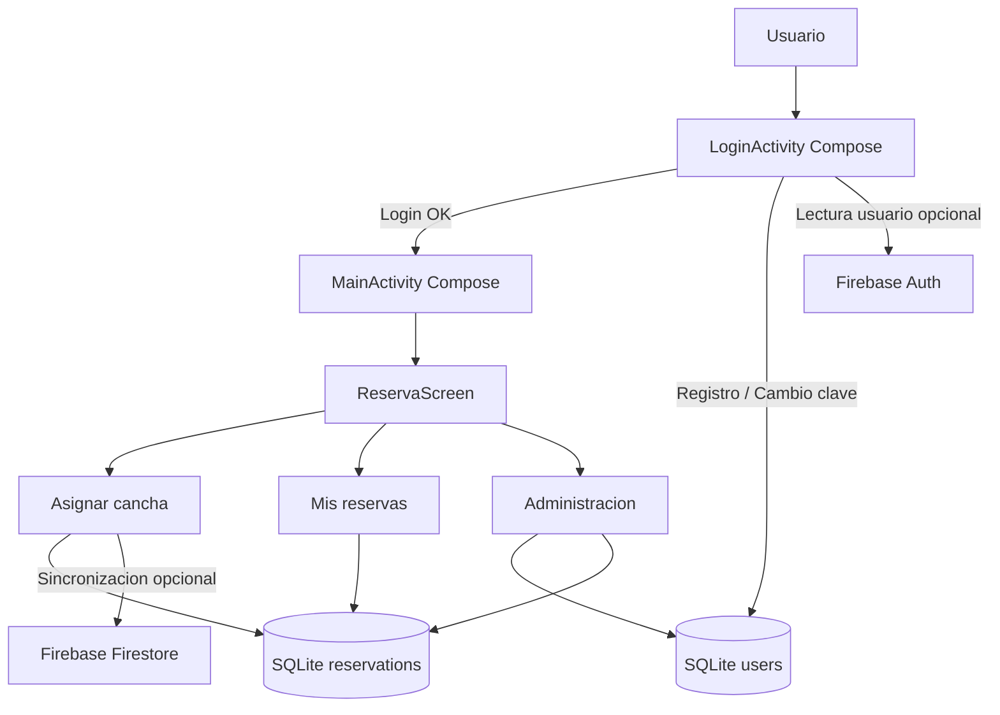
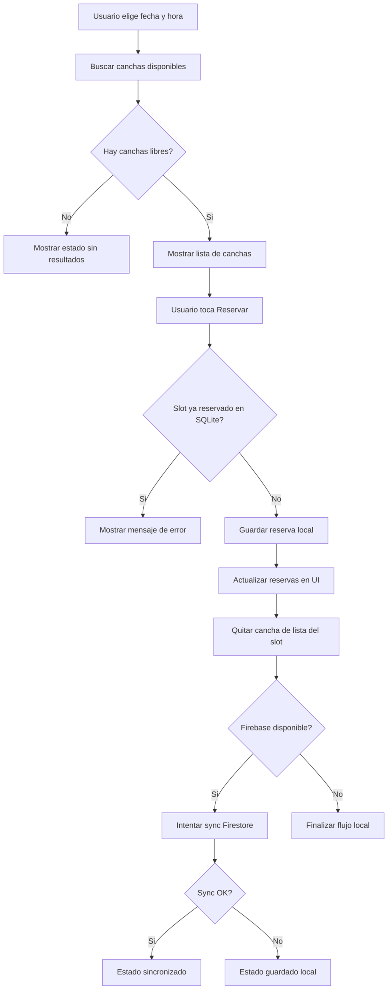
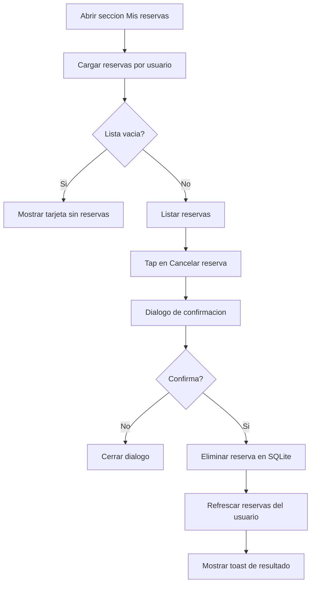

# Manual Tecnico - Campo Libre Futbol

## 1. Resumen del Proyecto
Campo Libre Futbol es una aplicacion Android para:
- autenticacion de usuarios local,
- reserva de canchas por fecha y franja horaria,
- visualizacion de reservas del usuario,
- administracion de usuarios y reservas para perfiles admin,
- exportacion de datos (CSV) de usuarios y reservas.

La interfaz principal esta implementada con Jetpack Compose.

## 2. Stack Tecnologico
- Lenguaje: Kotlin
- UI: Jetpack Compose + Material 3
- Persistencia local: SQLite (SQLiteOpenHelper)
- Autenticacion remota opcional: Firebase Auth (lectura de usuario actual)
- Sincronizacion remota opcional: Firestore (coleccion de reservas)
- Exportaciones: archivos CSV en almacenamiento de app + compartir con FileProvider

## 3. Estructura Actual de Codigo
Archivos principales:
- app/src/main/java/com/example/campolibrefutbol/LoginActivity.kt
- app/src/main/java/com/example/campolibrefutbol/MainActivity.kt
- app/src/main/java/com/example/campolibrefutbol/SQLiteUserHelper.kt
- app/src/main/java/com/example/campolibrefutbol/ui/main/home/HomeSection.kt
- app/src/main/java/com/example/campolibrefutbol/ui/main/reservations/ReservationSections.kt
- app/src/main/java/com/example/campolibrefutbol/ui/main/admin/MainAdminSection.kt
- app/src/main/java/com/example/campolibrefutbol/ui/main/navigation/MainNavigation.kt
- app/src/main/java/com/example/campolibrefutbol/ui/main/common/MainSharedComponents.kt
- app/src/main/java/com/example/campolibrefutbol/ui/theme/Theme.kt
- app/src/main/java/com/example/campolibrefutbol/ui/theme/Color.kt

## 4. Flujo Funcional
### 4.1 Login / Registro / Cambio de clave
- Pantalla: LoginActivity + LoginScreen (Compose)
- Validaciones:
  - correo con formato basico,
  - politica de password (8+, mayuscula, numero y simbolo),
  - control de intentos fallidos y bloqueo temporal.

### 4.2 Reserva de cancha
- Pantalla: MainActivity -> ReservaScreen -> seccion "Asignar cancha"
- Usuario selecciona:
  - fecha,
  - franja horaria (10:00 a 22:00).
- Se buscan canchas disponibles para ese slot.
- Al reservar:
  - se guarda primero en SQLite,
  - si esta disponible Firebase, se intenta sincronizar en Firestore.

### 4.3 Mis reservas
- Pantalla: MainActivity -> ReservaScreen -> seccion "Mis reservas"
- Muestra solo reservas del usuario logueado.
- Permite cancelar reserva propia con confirmacion.

### 4.4 Administracion (solo admin)
- Pantalla: MainActivity -> ReservaScreen -> seccion "Administracion de usuario"
- Permite:
  - ver usuarios,
  - promover/revocar admin,
  - eliminar usuarios (con reservas asociadas),
  - ver y eliminar reservas,
  - filtrar y ordenar,
  - exportar usuarios/reservas a CSV.

## 5. Cambios Implementados en Esta Iteracion
### 5.1 Disponibilidad real por reserva guardada
Se incorporo la disponibilidad dinamica basada en reservas SQLite para que una cancha no aparezca disponible si ya fue reservada en la misma fecha y hora.

### 5.2 Bloqueo de duplicados en guardado
En SQLiteUserHelper.saveReservation se agrego validacion previa:
- si existe una reserva con la misma cancha + fecha + hora, no inserta y devuelve error.

### 5.3 Vista de reservas por usuario
Se agrego en SQLiteUserHelper:
- getReservationsByUser(email)

Y en la UI:
- nueva seccion "Mis reservas" en menu lateral,
- contador de "Mis reservas" en Inicio,
- refresco de reservas del usuario despues de guardar/eliminar.

### 5.4 Cancelacion de reserva del usuario
En "Mis reservas" se agrego:
- boton "Cancelar reserva" por item,
- dialogo de confirmacion,
- eliminacion y refresco de lista.

### 5.5 Mejora de experiencia visual (colores)
Se refactorizo la paleta de colores y esquemas Material 3 (claro/oscuro) para:
- mejor contraste,
- mejor jerarquia de superficies,
- mayor legibilidad de texto y estados.

## 6. Base de Datos Local (SQLite)
Archivo de BD: campolibre_users.db

### 6.1 Tabla users
Campos relevantes:
- email (unico)
- password_hash
- password_salt
- failed_attempts
- locked_until
- created_at
- is_admin

### 6.2 Tabla reservations
Campos relevantes:
- id
- cancha_id
- cancha_nombre
- cancha_tipo
- fecha (dd/MM/yyyy)
- hora (rango, ej: 18:00 - 19:00)
- usuario_email
- precio
- created_at

## 7. Integracion Firebase (Opcional)
- El guardado remoto se intenta en Firestore (coleccion: reservas).
- Si falla Firebase, la reserva queda localmente en SQLite.
- La app sigue funcionando offline en modo local.

## 8. Exportacion CSV
Desde administracion se puede:
- guardar CSV de usuarios,
- guardar CSV de reservas,
- compartir cada CSV via Intent (FileProvider).

## 9. Limpieza de Archivos No Usados
Se eliminaron layouts XML heredados de una version basada en Views, porque la app actual usa Compose en sus pantallas principales y no utiliza setContentView.

Resultado:
- se reduce ruido de mantenimiento,
- menor riesgo de inconsistencias entre UI XML y Compose.

## 10. Recomendaciones Tecnicas
1. Agregar tests de unidad para SQLiteUserHelper (duplicados, filtros por usuario, bloqueos).
2. Migrar persistencia a Room para consultas tipadas y migraciones mas seguras.
3. Normalizar modelo de fecha/hora (timestamps) para filtros y orden mas robustos.
4. Agregar pruebas UI Compose para flujo reservar/cancelar.

## 11. Como Validar Funcionalmente
1. Crear usuario o iniciar sesion.
2. Reservar una cancha en fecha+hora.
3. Buscar nuevamente la misma fecha+hora: esa cancha no debe aparecer.
4. Intentar reservar el mismo slot por segunda vez: debe rechazar.
5. Ir a "Mis reservas" y verificar que se vea la reserva.
6. Cancelar reserva desde "Mis reservas" y confirmar que desaparece.
7. Si el usuario es admin, validar panel de administracion y exportaciones CSV.

## 12. Diagrama de Arquitectura (Alto Nivel)

## 13. Diagrama de Flujo - Reserva de Cancha

## 14. Diagrama de Flujo - Mis Reservas

## 15. Mapa de Modulos y Responsabilidades
### 15.1 Capa de Presentacion
- LoginActivity.kt
  - entrada principal de la app
  - renderiza LoginScreen (Compose)
  - orquesta login, registro y cambio de clave
- MainActivity.kt
  - renderiza ReservaScreen (Compose)
  - actua como orquestador de estado y navegacion interna
  - integra guardado local, sync opcional Firebase y callbacks de UI
- ui/main/home/HomeSection.kt
  - seccion Inicio (resumen, KPIs y accesos rapidos)
- ui/main/reservations/ReservationSections.kt
  - secciones Asignar cancha y Mis reservas
- ui/main/admin/MainAdminSection.kt
  - seccion Administracion de usuarios y reservas
- ui/main/navigation/MainNavigation.kt
  - menu lateral derecho y opciones de navegacion
- ui/main/common/MainSharedComponents.kt
  - componentes reutilizables (cards, titulos, selectores, item de cancha)

### 15.2 Capa de Datos Locales
- SQLiteUserHelper.kt
  - crea/actualiza BD local
  - metodos de usuarios (alta, rol admin, borrado, password policy)
  - metodos de reservas (alta, listado general, listado por usuario, borrado)
  - evita duplicados por cancha+fecha+hora

### 15.3 Capa de UI Theme
- ui/theme/Color.kt
  - paleta base de colores de marca
- ui/theme/Theme.kt
  - esquema Material 3 claro/oscuro
  - contraste y jerarquia visual de superficies

## 16. Matriz de Trazabilidad (Feature -> Codigo)
| Feature | Punto principal de implementacion |
|---|---|
| Login/registro/cambio clave | LoginActivity.kt + SQLiteUserHelper.kt |
| Bloqueo por intentos fallidos | SQLiteUserHelper.kt |
| Asignar cancha | ui/main/reservations/ReservationSections.kt (AssignmentSection) |
| Evitar doble reserva mismo slot | SQLiteUserHelper.kt (saveReservation + validacion previa) |
| Mis reservas por usuario | ui/main/reservations/ReservationSections.kt + SQLiteUserHelper.kt (getReservationsByUser) |
| Cancelacion de reserva propia | ui/main/reservations/ReservationSections.kt (MyReservationsSection) |
| Admin usuarios/reservas | ui/main/admin/MainAdminSection.kt + SQLiteUserHelper.kt |
| Exportacion CSV | MainActivity.kt (helpers exportUsersToCsv/exportReservationsToCsv) |
| Sync Firebase opcional | MainActivity.kt (syncReservationToFirebase) |
| Estilos y colores | ui/theme/Color.kt + ui/theme/Theme.kt |

## 17. Operacion y Mantenimiento
### 17.1 Checklist rapido antes de release
1. Validar login con usuario normal y admin.
2. Validar reserva y bloqueo de duplicado de slot.
3. Validar alta/baja de reservas en Mis reservas.
4. Validar filtros y exportaciones CSV de admin.
5. Validar experiencia visual en modo claro/oscuro.

### 17.2 Riesgos tecnicos actuales
1. SQLite directo sin capa DAO tipada (mas riesgo en cambios futuros).
2. Fechas en formato texto (riesgo de orden/filtro en escenarios complejos).
3. Dependencia opcional de Firebase sin cola de reintentos offline.

### 17.3 Mejoras sugeridas a corto plazo
1. Migrar a Room con entidades e indices para reservas.
2. Unificar manejo de fecha/hora con epoch millis.
3. Agregar test unitario de validacion de slot duplicado.
4. Agregar test UI Compose para flujo completo reservar/cancelar.

## 18. Historial de Cambios Recientes
1. Se agrego validacion para impedir doble reserva de una cancha en mismo horario.
2. Se incorporo seccion Mis reservas por usuario logueado.
3. Se agrego cancelacion de reserva desde Mis reservas.
4. Se mejoro paleta de colores para UX (claro/oscuro).
5. Se eliminaron layouts XML heredados no utilizados.

## 19. Rutas y Enlace Entre Archivos (Trazabilidad Tecnica)
Esta seccion detalla como se van enlazando Activities, Composables y metodos de datos para identificar rapidamente el recorrido de cada funcionalidad.

### 19.1 Ruta de inicio de aplicacion
1. AndroidManifest.xml
  - Launcher definido en: `.LoginActivity`
2. LoginActivity.kt
  - `onCreate()` inicializa `SQLiteUserHelper`
  - renderiza `LoginScreen(...)`

### 19.2 Ruta de login exitoso
1. LoginActivity.kt -> LoginScreen(onLogin)
2. LoginActivity.kt
  - valida credenciales con `userDb.validateUserWithPolicy(...)`
3. LoginActivity.kt
  - navega con `Intent(this, MainActivity::class.java)`
  - envia extras: `user_email`, `is_admin`
4. MainActivity.kt
  - `onCreate()` recibe extras y abre `ReservaScreen(...)`

### 19.3 Ruta de reserva de cancha
1. MainActivity.kt -> `ReservaScreen(...)`
2. MainActivity.kt -> seccion `AppSection.ASSIGN`
3. ui/main/reservations/ReservationSections.kt -> `AssignmentSection(...)`
4. MainActivity.kt -> accion `onBuscar`
  - carga reservas: `loadReservations()`
  - filtra disponibilidad: `obtenerCanchasDisponibles(fecha, hora, reservations)`
5. MainActivity.kt -> accion `onReservar`
  - guarda local: `saveReservation(cancha, fecha, hora, email)`
6. SQLiteUserHelper.kt -> `saveReservation(...)`
  - valida duplicado: `isReservationSlotTaken(canchaId, fecha, hora)`
  - inserta en tabla `reservations`
7. MainActivity.kt -> `syncReservationToFirebase(...)` (opcional)

### 19.4 Ruta de Mis Reservas
1. MainActivity.kt -> menu lateral -> `AppSection.MY_RESERVATIONS`
2. MainActivity.kt -> `refreshUserReservations()`
3. MainActivity.kt -> `loadReservationsByUser(email)`
4. SQLiteUserHelper.kt -> `getReservationsByUser(email)`
5. ui/main/reservations/ReservationSections.kt -> `MyReservationsSection(...)`
6. MainActivity.kt -> `onCancelReservation(id)`
7. SQLiteUserHelper.kt -> `deleteReservation(id)`

### 19.5 Ruta de Administracion (solo admin)
1. MainActivity.kt -> menu lateral -> `AppSection.USERS`
2. ui/main/admin/MainAdminSection.kt -> `UserManagementSection(...)`
3. Acciones de usuarios:
  - `updateUserAdmin(email, isAdmin)` -> SQLiteUserHelper.kt
  - `deleteUser(email)` -> SQLiteUserHelper.kt
4. Acciones de reservas:
  - `deleteReservation(id)` -> SQLiteUserHelper.kt
5. Exportacion:
  - `exportUsersToCsv(...)` y `exportReservationsToCsv(...)` -> MainActivity.kt

### 19.6 Tabla rapida de enlaces archivo a archivo
| Origen | Destino | Motivo |
|---|---|---|
| AndroidManifest.xml | LoginActivity.kt | Activity launcher |
| LoginActivity.kt | SQLiteUserHelper.kt | Validacion, registro y cambio de clave |
| LoginActivity.kt | MainActivity.kt | Navegacion post-login |
| MainActivity.kt | ui/main/home/HomeSection.kt | Seccion Inicio |
| MainActivity.kt | ui/main/reservations/ReservationSections.kt | Secciones de reservas |
| MainActivity.kt | ui/main/admin/MainAdminSection.kt | Seccion admin |
| MainActivity.kt | ui/main/navigation/MainNavigation.kt | Menu lateral |
| ui/main/home/HomeSection.kt | ui/main/common/MainSharedComponents.kt | Componentes compartidos |
| ui/main/reservations/ReservationSections.kt | ui/main/common/MainSharedComponents.kt | Componentes compartidos |
| ui/main/admin/MainAdminSection.kt | ui/main/common/MainSharedComponents.kt | Componentes compartidos |
| MainActivity.kt | SQLiteUserHelper.kt | Carga/guardado/borrado de reservas y usuarios |
| MainActivity.kt | ui/theme/Theme.kt | Aplicacion de tema Material 3 |
| ui/theme/Theme.kt | ui/theme/Color.kt | Definicion de paleta de colores |

### 19.7 Convencion para identificar rapido una funcionalidad
Para ubicar cualquier feature usa esta secuencia:
1. Entrada UI (Activity/Seccion Compose)
2. Callback de accion (`onClick`, `onBuscar`, `onReservar`, etc.)
3. Metodo puente en MainActivity.kt
4. Metodo de persistencia en SQLiteUserHelper.kt
5. Refresco de estado Compose (`users`, `reservations`, `userReservations`)
